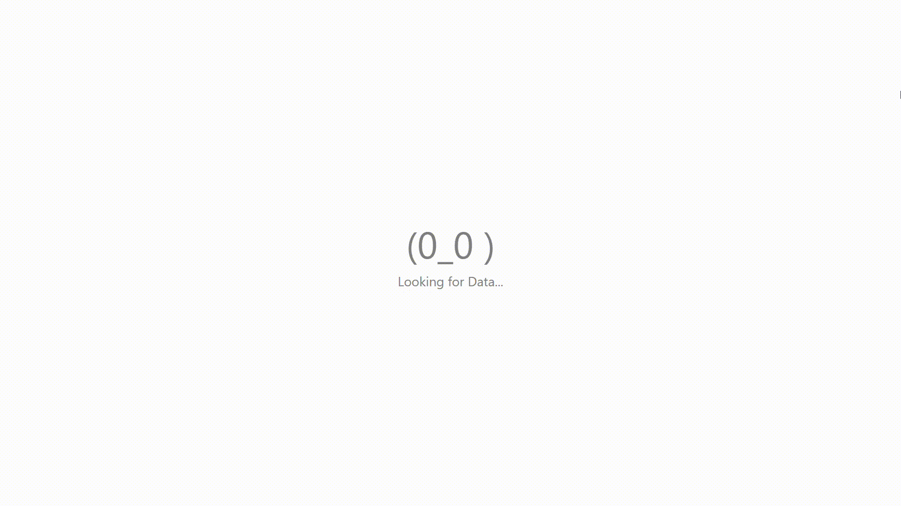

# Fun UI

`Fun UI` is a lightweight React Component Library designed to bring a playful and engaging experience to your web applications. With a focus on creative and fun emoticon-based components, `Fun UI` allows developers to add a personal touch to their interfaces effortlessly. Perfect for projects that aim to stand out with unique and interactive elements, `Fun UI` is both easy to use and highly customizable.

## Table of Contents

- [Features](#features)
- [Installation](#installation)
- [Usage Demo](#usage-demo)
- [Components](#components)
  - [Loader](#loader)
    - [Face Loader](#face-loader)
    - [Classic Loader](#classic-loader)
    - [Sand Watch Loader](#sand-watch-loader)
  - [Emoticons](#emoticons)
    - [Classic Emoticons](#classic-emoticons)
    - [Face Emoticons](#face-emoticons)
- [License](#license)
- [Contributing](#contributing)


## Features
- **Playful Emoticons:** Inject fun and personality into your website with a wide range of emoticon-based components.
- **Customizable:** Tailor the components to match your brand’s style and preferences.
- **Seamless Integration:** Easily integrate components into your project with minimal setup.


## Installation
To install the package, use npm:
```bash
npm install @moj-ui/fun-ui
```

## Usage Demo

A basic example of `<FaceLoader />` from `@moj-ui/fun-ui`.

```javascript
import { FaceLoader } from '@moj-ui/fun-ui';

function App() {
  return (
    <div className="App">
      <FaceLoader variant={1} caption={"Looking for Data..."} captionStyle={{fontSize:"0.35em"}} time={1000}/>
    </div>
  );
}

export default App;
```

### Output :


## Components

1. **Loader:**{#loader} A collection of fun Loaders built using emoticons which adds an enjoyable touch to your React application.
   - **Face Loader:** Collections of exciting Loaders consisting of face emoticons. [Click here](src/components/Loader/FaceLoader) to explore more.
   - **Classic Loader:** Collection of Classic Loaders built using Emoticons. [Click here](src/components/Loader/CLassicLoader) to explore more.
   - **Sand Watch Loader:** Add an emoticon Sand Watch as a loader to add an unique touch to your loading screen. [Click here](src/components/Loader/GlassWatchLoader) to know more.
2. **Emoticons:** Collections of Old-School & Classic emoticons as well as many more.
   - **Classic Emoticons:** Collection of Classic-Old school emoticons. [Click here](src/components/Emoticons/ClassicEmoticon) to explore more.
   - **Face Emoticons:** Collection of Face emoticons to add a fun & personal touch to your React App. [Click here](src/components/Emoticons/FaceEmoticon) to know more.
