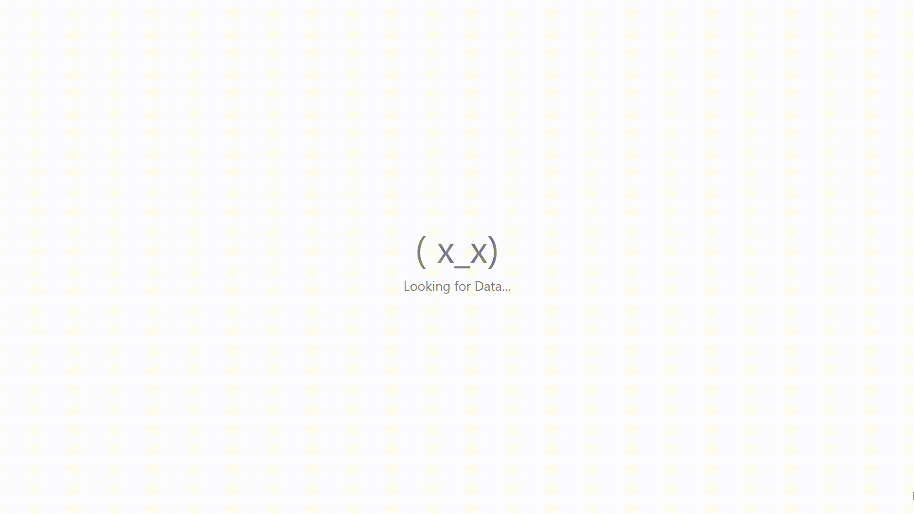

# Fun UI

`Fun UI` is a lightweight React Component Library designed to bring a playful and engaging experience to your web applications. With a focus on creative and fun emoticon-based components, `Fun UI` allows developers to add a personal touch to their interfaces effortlessly. Perfect for projects that aim to stand out with unique and interactive elements, `Fun UI` is both easy to use and highly customizable.

## Table of Contents

- [Features](#features)
- [Installation](#installation)
- [Usage Demo](#usage-demo)
- [Components](#components)
  - [Loader](#1-loader)
    - [Face Loader](#--face-loader)
      - [Usage](#usage)
      - [Customisation](#customisation)
      - [Variants](#variants)
    - [Classic Loader](#--classic-loader)
      - [Usage](#usage)
      - [Customisation](#customisation)
      - [Variants](#variants)
    - [Sand Watch Loader](#--sand-watch-loader)
      - [Usage](#usage)
      - [Customisation](#customisation)
      - [Variants](#variants)
  - [Emoticons](#2-emoticons)
    - [Classic Emoticons](#--classic-emoticons)
    - [Face Emoticons](#--8face-emoticons)
- [License](#license)
- [Contributing](#contributing)

## Features

- **Playful Emoticons:** Inject fun and personality into your website with a wide range of emoticon-based components.
- **Customizable:** Tailor the components to match your brand’s style and preferences.
- **Seamless Integration:** Easily integrate components into your project with minimal setup.

## Installation

To install the package, use npm:

```bash
npm install @moj-ui/fun-ui
```

## Usage Demo

A basic example of `<FaceLoader />` from `@moj-ui/fun-ui`.

```javascript
import { FaceLoader } from "@moj-ui/fun-ui";

function App() {
  return (
    <div className="App">
      <FaceLoader
        variant={1}
        caption={"Looking for Data..."}
        captionStyle={{ fontSize: "0.35em" }}
        time={1000}
      />
    </div>
  );
}

export default App;
```

### Output :


## Components

### 1. Loader:

A collection of fun Loaders built using emoticons which adds an enjoyable touch to your React application.

#### - Face Loader:

Collections of exciting Loaders consisting of face emoticons.

##### Usage:

To use Face Loader component, you can import it from `@moj-ui/fun-ui` and use it in your app.

You can import `Face Loader` from `@moj-ui/fun-ui` as:

```javascript
import { FaceLoader } from "@moj-ui/fun-ui";
```

Basic usage eg:

```javascript
import { FaceLoader } from "@moj-ui/fun-ui";

function Demo() {
  return (
    <div className="demo">
      <FaceLoader />
    </div>
  );
}

export default Demo;
```

**Output:**


##### Customisation:

You can use in built attritbutes to customise loader according to your personal touch.

###### Attributes:

1. **variant:** You can use `variant` attribute to choose from various Variants available according to you want. The `default` value is `1`. Choose the index of the loader you want to choose. Click [here](#face-loader-variants) to see the available Face Loaders.

eg:

```javascript
import { FaceLoader } from "@moj-ui/fun-ui";

function Demo() {
  return (
    <div className="demo">
      <FaceLoader variant={20} />
    </div>
  );
}
export default Demo;
```

Output:


2. **time:** You can change the time interval of loader using `time` attribute. The `time` takes time in `ms`. The `default` value is `2000` ms. Remember `1 s = 1000 ms`.

eg :

To set time interval to 1 sec.

```javascript
import { FaceLoader } from "@moj-ui/fun-ui";

function Demo() {
  return (
    <div className="demo">
      <FaceLoader time={1000} />
    </div>
  );
}
export default Demo;
```

Output:
[FaceLoaderDemo1000](assets/gifs/loaders/FaceLoader/FaceLoaderUsage1000.gif)

To set time interval to 3 sec.

```javascript
import { FaceLoader } from "@moj-ui/fun-ui";

function Demo() {
  return (
    <div className="demo">
      <FaceLoader time={3000} />
    </div>
  );
}
export default Demo;
```

Output:
[FaceLoaderDemo3000](assets/gifs/loaders/FaceLoader/FaceLoaderUsage3000.gif)

3. **style:** you can use custom CSS according to you need.

eg:

To increase the size & colour of the loader, you can pass an object in `style` attribute.

```javascript
const newStyle = {
  color: "green", // To change the color to green.
  fontSize: "6em", // To change the size of Loader to 6em.
};
```

Complete Code :

```javascript
import { FaceLoader } from "@moj-ui/fun-ui";

function Demo() {
  const newStyle = {
    color: "green",
    fontSize: "6em",
  };

  return (
    <div className="demo">
      <FaceLoader style={newStyle} />
    </div>
  );
}
export default Demo;
```

Output:
[FaceLoaderDemoStyle](assets/gifs/loaders/FaceLoader/FaceLoaderUsageStyle.gif)

The Default `style` is:

- color : grey
- size : 4rem

4. **caption:** You can add a caption to you loader to make it even more personal.

eg:

To add caption `Looking for Data...`

```javascript
import { FaceLoader } from "@moj-ui/fun-ui";

function Demo() {
  return (
    <div className="demo">
      <FaceLoader caption={"Looking for Data..."} />
    </div>
  );
}
export default Demo;
```

Output:
[FaceLoaderDemoCaption](assets/gifs/loaders/FaceLoader/FaceLoader1.gif)

The default value of `caption` is `none`.

you can use `captionStyle` property to customise caption according to your need.

```javascript
import { FaceLoader } from "@moj-ui/fun-ui";

function Demo() {
  const newStyle = {
    color: "green",
    fontSize: "2em",
  };

  return (
    <div className="demo">
      <FaceLoader caption={"Looking for Data..."} captionStyle={newStyle} />
    </div>
  );
}
export default Demo;
```

Output:
[FaceLoaderDemoCaptionStyle](assets/gifs/loaders/FaceLoader/FaceLoaderCaptionStyle.gif)

the default style of caption is:

- color : grey
- size : 0.35em

##### Variants

| Variant | Loader | Output |
|:-------:|:------:|:------:|
| 1 | (0_0)  |  |
| 2 | (`~`0_0`~`) |  |
| 3 | (`*`0_0`*`) | |
| 4 | ( !0_0) | |
| 5 | (o_o) | |
| 6 | (`~`o_o`~`) | |
| 7 | (\*o_o\*) | |
| 8 | ( !o_o) | |
| 9 | (O_O) | |
| 10 | (`~`O_O`~`) | |
| 11 | (\*O_O\*) | |
| 12 | ( !O_O)| |
| 13 | (^_^)| |
| 14 | (`~`^_^`~`)| |
| 15 | (\*^_^\*)| |
| 16 | ( !^_^)| |
| 17 | (^.^)| |
| 18 |(`~`^.^`~`)| |
| 19 |(\*^.^\*)| |
| 20 |( !^.^)| |
| 21 | (-_-)| |
| 22 |( !-_-)| |
| 23 |(T_T)| |
| 24 |(\*_\*)| |
| 25 |(\*o\*)| |
| 26 |(\*.\*)| |
| 27 |(>_<)| |
| 28 |("_")| |
| 29 |( !"_")| |
| 30 |(=_=)| |
| 31 |( !=_=)| |
| 32 |(U_U)| |
| 33 |(`~`U_U`~`)| |
| 34 |(\*U_U\*)| |
| 35 |( !U_U)| |
| 36 |(V_V)| |
| 37 |(`~`V_V`~`)| |
| 38 |(\*V_V\*)| |
| 39 |( !V_V)| |
| 40 |(U.U)| |
| 41 |(`~`U.U`~`)| |
| 42 |(\*U.U\*)| |
| 43 |( !U.U)| |
| 44 |(`$`_`$`)| |
| 45 |(X_X)| |
| 46 |( !X_X)| |
| 47 |(x_x)| |
| 48 |( !x_x)| |
| 49 |(+_+)| |
| 50 |( !+_+)| |
| 51 |('_')| |
| 52 |(`~`'_'`~`)| |
| 53 |(\*'_'\*)| |
| 54 |( !'_')| |
| 55 | (O_O) - (-_-)| |


#### - Classic Loader:

Collection of Classic Loaders built using Emoticons. [Click here](src/components/Loader/CLassicLoader) to explore more.

#### - Sand Watch Loader:

Add an emoticon Sand Watch as a loader to add an unique touch to your loading screen. [Click here](src/components/Loader/GlassWatchLoader) to know more.

### 2. Emoticons:

Collections of Old-School & Classic emoticons as well as many more.

#### - Classic Emoticons:

Collection of Classic-Old school emoticons. [Click here](src/components/Emoticons/ClassicEmoticon) to explore more.

#### - Face Emoticons:

Collection of Face emoticons to add a fun & personal touch to your React App. [Click here](src/components/Emoticons/FaceEmoticon) to know more.
